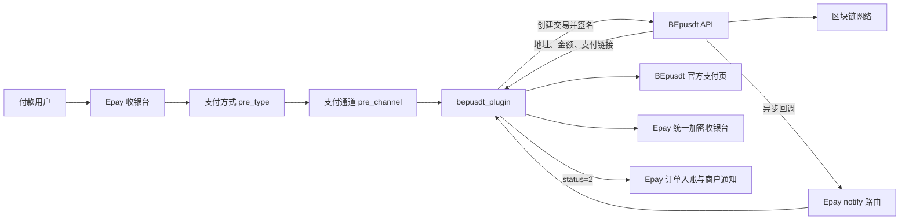
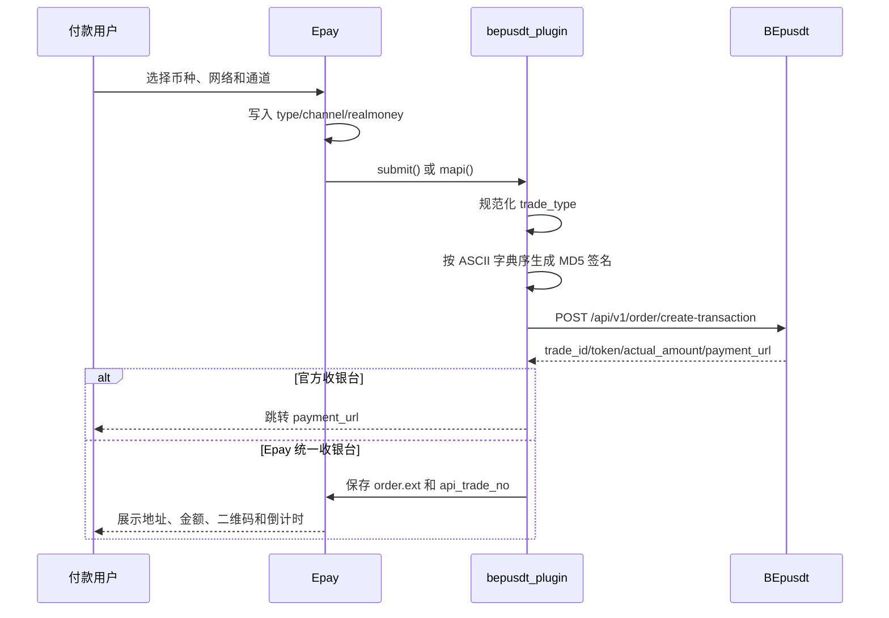

# Epay 与 BEpusdt 融合说明

> 文档状态：已实现基线与上线验收指南
> 核查日期：2026-07-28
> 对应 Epay 提交：`e4816e500cef`
> 对照上游：`maajiko/Epay@a4d0f0421cfc`
> 适用对象：开发、测试、部署、运营与安全审查人员

## 1. 文档目的

本文描述当前 Epay 项目与 BEpusdt 的完整融合方式，包括：

- BEpusdt 插件在 Epay 中的职责和系统边界；
- 支付方式、支付通道、收银台、下单和回调之间的调用关系；
- 后台配置、批量导入及日常验证方法；
- 请求签名、订单扩展数据和状态映射；
- 当前已经实现的安全能力、自动化验证和生产验收边界。

本文以当前仓库代码为事实基线。标记为“生产验收”或“后续事项”的内容尚未在真实部署环境完成，不能视为已上线验证。

## 2. 外部协议基线

融合实现以 BEpusdt 官方资料为准：

- [BEpusdt 主项目](https://github.com/v03413/BEpusdt)
- [API 对接文档](https://github.com/v03413/BEpusdt/blob/main/docs/api/api.md)
- [回调通知说明](https://github.com/v03413/BEpusdt/blob/main/docs/notify/readme.md)
- [交易类型列表](https://github.com/v03413/BEpusdt/blob/main/docs/trade-type.md)
- [彩虹易支付官方对接插件](https://github.com/v03413/Epay-BEpusdt)

官方协议可能持续更新。升级 BEpusdt 前，应重新核对 API 字段、回调状态和 `trade_type` 列表。

## 3. 融合范围与系统边界

Epay 负责：

- 创建和保存商户订单；
- 根据支付方式选择 BEpusdt 支付通道；
- 调用 BEpusdt 创建交易；
- 展示官方或站内统一加密货币收银台；
- 验证 BEpusdt 回调签名；
- 将已确认支付转换为 Epay 已支付订单；
- 执行商户异步通知、同步返回和账务处理。

BEpusdt 负责：

- 分配或使用指定收款地址；
- 计算法币金额对应的加密货币实付数量；
- 扫描链上交易并完成订单匹配；
- 提供官方支付页；
- 向 Epay 推送等待支付、支付成功和支付超时事件。

链上节点、钱包私钥和归集策略均由 BEpusdt 管理，不应进入 Epay 插件配置或日志。

## 4. 总体架构



## 5. 关键代码清单

| 范围 | 文件 | 职责 |
|---|---|---|
| 核心插件 | [`plugins/bepusdt/bepusdt_plugin.php`](../plugins/bepusdt/bepusdt_plugin.php) | 插件声明、交易类型、创建交易、回调状态分派与返回 |
| 协议与 HTTP | [`plugins/bepusdt/BepusdtProtocol.php`](../plugins/bepusdt/BepusdtProtocol.php) | 签名、URL/响应/回调校验、TLS HTTP 客户端与响应大小限制 |
| 插件装载 | [`includes/lib/Plugin.php`](../includes/lib/Plugin.php) | 根据通道加载 `bepusdt_plugin` 并调用 `submit`、`mapi`、`notify`、`return` |
| 通道读取 | [`includes/lib/Channel.php`](../includes/lib/Channel.php) | 从 `pre_channel.config` 解出 BEpusdt 配置 |
| 支付提交 | [`submit2.php`](../submit2.php) | 选中支付方式和通道，写入订单并调用插件 |
| 支付类型后台 | [`admin/pay_type.php`](../admin/pay_type.php) | 展示 BEpusdt 支付类型并提供一键导入 |
| 通道后台 | [`admin/pay_channel.php`](../admin/pay_channel.php) | 创建、配置及批量导入 BEpusdt 通道 |
| 后台接口 | [`admin/ajax_pay.php`](../admin/ajax_pay.php) | 执行交易类型导入和通道批量导入 |
| 币种分类 | [`includes/pay_type_category.php`](../includes/pay_type_category.php) | 将 `usdt.trc20` 等调用值映射为币种和网络 |
| 类型排序 | [`includes/pay_type_crypto_sort.php`](../includes/pay_type_crypto_sort.php) | 控制后台 BEpusdt 类型的展示顺序 |
| 图标服务 | [`includes/pay_type_icon.php`](../includes/pay_type_icon.php) | 服务端生成稳定币链图标 |
| 图标脚本 | [`assets/js/pay-type-icon.js`](../assets/js/pay-type-icon.js) | 浏览器端生成稳定币链图标 |
| 主收银台 | [`cashier.php`](../cashier.php) | 按“币种 → 网络 → 通道”组织支付选择 |
| 加密收银台 | [`includes/pages/crypto.php`](../includes/pages/crypto.php) | 展示地址、金额、二维码、倒计时并轮询支付状态 |
| 支付状态查询 | [`getshop.php`](../getshop.php) | 向收银台返回 Epay 订单最终状态 |
| 支付结果页 | [`paysuccess.php`](../paysuccess.php) | 展示支付确认过渡和最终完成信息 |
| 订单处理 | [`includes/lib/Payment.php`](../includes/lib/Payment.php) | 更新 `api_trade_no`、订单扩展数据及 API 返回 |
| 数据结构 | [`install/install.sql`](../install/install.sql) | 定义 `pre_type`、`pre_channel`、`pre_order` 等表 |
| 数据迁移 | [`install/update6.sql`](../install/update6.sql) | 将插件类型字段扩展到 `varchar(500)` |
| 协议测试 | [`tests/BepusdtProtocolTest.php`](../tests/BepusdtProtocolTest.php) | 签名、响应、状态、错误回调与状态分派测试 |
| 数据库测试 | [`tests/DatabaseIntegrationTest.php`](../tests/DatabaseIntegrationTest.php) | 全新建库、2058 迁移与重复结算门闩测试 |

## 6. 当前已实现能力

### 6.1 支付方式管理

插件通过 `tradeTypeCatalog()` 声明 BEpusdt 交易类型。后台“支付方式”页面能够：

- 将支付方式按插件归类；
- 一键将插件目录中的全部类型写入 `pre_type`；
- 自动跳过相同“调用值 + 支持设备”的已有记录；
- 按 USDT、USDC、原生币和网络深度排序；
- 自动推导币种和网络，用于三级收银台。

### 6.2 支付通道管理

后台支持：

- 手工创建 BEpusdt 支付通道；
- 为通道配置网关地址、认证 Token、收款地址、超时、汇率和统一收银台；
- 通过 JSON 数组批量导入多个 BEpusdt 通道；
- 新导入通道默认关闭，管理员核验后再启用；
- 通过通道名称去重。

### 6.3 两种收银台模式

| 模式 | `unified_cashier` | 当前行为 |
|---|---:|---|
| BEpusdt 官方收银台 | `0` | 创建交易后跳转到 BEpusdt 返回的 `payment_url` |
| Epay 统一收银台 | `1` | 保存支付上下文，在本站展示地址、金额、二维码和倒计时 |

两种模式使用相同的 BEpusdt 创建交易与回调链路，只改变付款页面的呈现位置。

### 6.4 页面支付与 API 支付

- 页面支付调用 `bepusdt_plugin::submit()`。
- API 支付调用 `bepusdt_plugin::mapi()`。
- 开启统一收银台时，API 支付返回 `pay_type=crypto` 及支付上下文。
- 关闭统一收银台时，API 支付沿用跳转结果。

## 7. 数据模型

### 7.1 `pre_type`

每个 BEpusdt `trade_type` 对应一条 Epay 支付方式。

关键字段：

| 字段 | 含义 | 示例 |
|---|---|---|
| `name` | BEpusdt 调用值 | `usdt.trc20` |
| `showname` | 前后台展示名 | `USDT-TRC20` |
| `device` | 设备范围；`0` 表示 PC 与移动端 | `0` |
| `currency` | 收银台币种分类；可为空并自动推导 | `USDT` |
| `network` | 收银台网络分类；可为空并自动推导 | `TRC20` |
| `status` | 是否启用 | `1` |

### 7.2 `pre_channel`

每条通道绑定一个 `pre_type` 和 `bepusdt` 插件。

关键字段：

| 字段 | 含义 |
|---|---|
| `type` | 关联 `pre_type.id` |
| `plugin` | 固定为 `bepusdt` |
| `config` | BEpusdt 配置 JSON |
| `rate` | Epay 通道结算费率，不等同于 BEpusdt 币价汇率 |
| `status` | 通道是否启用 |
| `cashier_ok` | 是否允许在 Epay 收银台中使用 |

### 7.3 `pre_order`

BEpusdt 融合使用的主要字段：

| 字段 | 用途 |
|---|---|
| `trade_no` | Epay 订单号，也是发给 BEpusdt 的 `order_id` |
| `out_trade_no` | 商户订单号 |
| `type` | 支付方式 ID |
| `channel` | 支付通道 ID |
| `realmoney` | 发给 BEpusdt 的法币支付金额 |
| `api_trade_no` | BEpusdt `trade_id` |
| `bill_trade_no` | 支付成功回调中的链上 `block_transaction_id` |
| `status` | Epay 订单状态 |
| `ext` | 序列化后的统一收银台上下文 |
| `endtime` | 支付完成时间 |

## 8. 插件配置

| 配置项 | 必填 | 当前含义 | 建议 |
|---|---:|---|---|
| `appurl` | 是 | BEpusdt API 根地址 | 生产环境必须使用 HTTPS，并以 `/` 结尾 |
| `appkey` | 是 | BEpusdt 后台生成的 API 对接令牌 | 使用高强度随机值，禁止写入文档、代码或日志 |
| `address` | 否 | 指定收款地址 | 无明确需求时留空，让 BEpusdt 自动分配 |
| `timeout` | 否 | BEpusdt 订单有效期，单位秒 | 不低于官方最低值，建议与 Epay 订单生命周期一致 |
| `rate` | 否 | 强制指定币价汇率 | 不理解 BEpusdt 汇率规则时留空 |
| `unified_cashier` | 否 | 是否使用 Epay 站内收银台 | 上线前分别验证开启和关闭场景 |

`appkey` 应从 BEpusdt 后台“系统管理 → 基本设置 → API 设置 → 对接令牌”获取。

当前插件未提供可变 `fiat` 配置，但会向 BEpusdt 显式发送 `fiat=CNY`，并严格校验响应中的法币字段。多法币业务需要另行设计配置、金额精度和回归测试，不能仅修改请求字段。

## 9. 后台接入步骤

### 9.1 前置条件

1. BEpusdt 已部署并能从 Epay 服务器访问。
2. BEpusdt 已配置可用网络、收款地址和链上节点。
3. Epay 的 `localurl` 与站点 URL 均为外部可访问的 HTTPS 地址。
4. BEpusdt 能访问 Epay 的通知地址。
5. 两端服务器时间已同步。

### 9.2 注册插件

进入“支付接口 → 支付插件”，刷新插件列表并确认存在：

- 插件名：`bepusdt`
- 类名：`bepusdt_plugin`
- 插件目录：`plugins/bepusdt`

### 9.3 导入支付方式

进入“支付接口 → 支付方式”，在 BEpusdt 分组点击“一键导入全部交易类型”。

导入后至少检查：

- 调用值和展示名是否正确；
- 设备是否为 `PC+Mobile`；
- 币种和网络推导是否符合预期；
- 所需支付方式是否启用；
- 官方最新 `trade_type` 是否全部存在。

### 9.4 创建支付通道

每个需要独立配置、费率、限额或轮询权重的组合创建一条通道：

1. 选择对应支付方式，例如 `usdt.trc20`。
2. 选择插件 `bepusdt`。
3. 设置 Epay 费率、单笔限额和开放时间。
4. 填写 BEpusdt 配置。
5. 保存后先保持关闭。
6. 完成测试订单后再启用。

### 9.5 批量导入通道

后台批量导入接受 JSON 数组。示例仅使用占位符：

```json
[
  {
    "name": "BEpusdt-USDT-TRC20-1",
    "type": "usdt.trc20",
    "rate": "100",
    "costrate": "",
    "mode": 0,
    "daytop": 0,
    "daymaxorder": 0,
    "paymin": "",
    "paymax": "",
    "timestart": "",
    "timestop": "",
    "config": {
      "appurl": "https://bepusdt.example.com/",
      "appkey": "replace-with-secret-token",
      "address": "",
      "timeout": "1200",
      "rate": "",
      "unified_cashier": "1"
    }
  }
]
```

注意：

- 示例 Token 不能用于生产。
- 支付方式必须先存在于 `pre_type`。
- 导入程序按通道名称去重，不会更新同名通道。
- 导入完成的通道默认 `status=0`，需要人工复核并启用。

## 10. 创建交易流程

### 10.1 调用顺序



### 10.2 当前请求参数

| 参数 | 来源 | 是否总是发送 |
|---|---|---:|
| `order_id` | `TRADE_NO` | 是 |
| `amount` | `floatval($order['realmoney'])` | 是 |
| `fiat` | 固定值 `CNY` | 是 |
| `notify_url` | `localurl + pay/notify/{trade_no}/` | 是 |
| `redirect_url` | `siteurl + pay/return/{trade_no}/` | 是 |
| `trade_type` | 规范化并经目录校验的 `$order['typename']` | 是 |
| `address` | 通道配置 | 非空时 |
| `name` | 订单商品名 | 非空时 |
| `timeout` | 通道配置 | 大于 0 时 |
| `rate` | 通道配置 | 非空时 |
| `signature` | `BepusdtProtocol::sign()` | 是 |

### 10.3 `trade_type` 规范化

当前 `BepusdtProtocol::normalizeTradeType()` 会：

1. 去除首尾空格；
2. 转为小写；
3. 将 `-` 和 `_` 替换为 `.`。

示例：

| 输入 | 输出 |
|---|---|
| `USDT-TRC20` | `usdt.trc20` |
| `usdt_polygon` | `usdt.polygon` |
| `usdc.arbitrum` | `usdc.arbitrum` |

通道应绑定插件目录中声明的标准调用值，不应依赖规范化函数转换其他插件的复合命名。

### 10.4 签名算法

当前实现与 BEpusdt 官方规则一致：

1. 排除 `signature`；
2. 排除空字符串和 `null`；
3. 按参数名升序排序；
4. 拼接为 `key=value&key=value`；
5. 末尾直接追加 API Token；
6. 计算小写 MD5。

官方示例在当前实现中的计算结果为：

```text
1cd4b52df5587cfb1968b0c0c6e156cd
```

MD5 是 BEpusdt 当前协议要求，不能在 Epay 单方面替换；传输层仍必须使用安全 HTTPS。

## 11. 创建交易响应映射

成功响应中，当前融合使用以下字段：

| BEpusdt 字段 | Epay 用途 |
|---|---|
| `data.trade_id` | 写入 `pre_order.api_trade_no` |
| `data.token` | 统一收银台收款地址 |
| `data.actual_amount` | 统一收银台加密货币实付数量 |
| `data.fiat` | 统一收银台法币单位 |
| `data.amount` | 统一收银台法币金额 |
| `data.expiration_time` | 以当前时间加秒数计算到期时间 |
| `data.payment_url` | 官方收银台跳转或统一收银台兜底链接 |

当前实现会在使用这些字段前验证：

- `status_code` 必须严格等于数值 `200`；
- `data` 必须为对象；
- `trade_id`、`token`、`actual_amount` 和 `payment_url` 均必须存在且类型合法；
- `payment_url` 必须是合法 HTTPS URL；
- 金额必须是合法的正数十进制字符串；
- 响应的订单号、交易类型、法币和法币金额必须与请求一致；
- 异常响应记录脱敏错误并向用户返回可理解错误。

## 12. 统一收银台数据

开启统一收银台时，插件把以下数组序列化写入 `pre_order.ext`：

| 键 | 含义 |
|---|---|
| `plugin` | 固定为 `bepusdt` |
| `address` | 收款地址 |
| `amount` | 加密货币实付数量 |
| `currency` | `trade_type`，例如 `usdt.trc20` |
| `chain` | 当前留空，由页面从 `currency` 推导 |
| `fiat` | 法币代码 |
| `fiat_amount` | 法币金额 |
| `expire_at` | Epay 计算出的 UNIX 到期时间 |
| `qrcode` | 当前留空，由浏览器基于地址生成 |
| `fallback_url` | BEpusdt 官方支付链接 |
| `api_trade_no` | BEpusdt `trade_id` |

`includes/pages/crypto.php` 从该数据生成：

- 加密货币金额和法币金额；
- 收款地址；
- 网络提示；
- 本地二维码；
- 复制按钮；
- 倒计时；
- 官方收银页兜底入口；
- 订单状态轮询。

`ext` 当前使用 PHP 序列化格式。后续如迁移为 JSON，需要同时兼容历史订单。

## 13. 回调协议与订单状态

### 13.1 BEpusdt 官方状态

| `status` | 官方含义 | 正确的 Epay 行为 |
|---:|---|---|
| `1` | 等待支付；创建后立即发送并每分钟推送 | 验签后返回成功响应，不标记支付、不写“链上已检测” |
| `2` | 支付成功 | 验签、校验订单号、幂等处理，然后调用 `processNotify()` |
| `3` | 支付超时 | 验签后返回成功响应；可按产品策略记录超时状态 |

只有 `status=2` 可以驱动 Epay 订单入账。

### 13.2 Epay 订单状态

本融合依赖 Epay 既有状态：

| Epay `status` | 含义 |
|---:|---|
| `0` | 待支付 |
| `1` | 支付成功 |
| `2` | 支付异常或失败 |

`processNotify()` 负责支付成功后的数据库更新、商户通知和账务流程。插件不得自行绕过该入口直接把订单改为已支付。

### 13.3 已实现的回调验证顺序

当前顺序：

1. 读取原始请求体；
2. 确认是合法 JSON 对象；
3. 检查 `signature`、`order_id` 和 `status`；
4. 使用常量时间比较校验签名；
5. 确认 `order_id === TRADE_NO`；
6. 根据状态执行明确分支；
7. `status=2` 时提取 `trade_id` 和 `block_transaction_id`；
8. 调用 Epay 幂等订单处理；
9. 返回 BEpusdt 认可的成功文本。

任何格式错误或签名失败都不得修改订单。

### 13.4 当前状态映射

当前代码已经按 13.1 至 13.3 节实现：

1. `status=1` 验签后只返回 `HTTP 200` 与 `ok`，不修改订单；
2. `status=2` 调用 `processNotify()`，`trade_id` 写入 `api_trade_no`；
3. `block_transaction_id` 写入 `bill_trade_no`，不再把钱包或交易字段误写为 `buyer`；
4. `status=3` 仅在未支付订单上以行锁合并方式记录网关超时，不触发结算；
5. 非法 JSON、缺失字段、错误签名、订单号或网关交易号不匹配均安全失败；
6. 订单支付状态使用带 `status IN (0,4)` 条件的原子更新，重复回调不会重复结算；
7. 支付结果页的短暂过渡只表达“正在确认订单”，不再声称已检测链上交易。

## 14. 当前交易类型

### 14.1 仓库当前目录

当前插件声明 23 个类型：

| 网络 | USDT | USDC | 原生币 |
|---|---|---|---|
| Tron | `usdt.trc20` | `usdc.trc20` | `tron.trx` |
| Ethereum | `usdt.erc20` | `usdc.erc20` | `ethereum.eth` |
| Polygon | `usdt.polygon` | `usdc.polygon` | — |
| BSC | `usdt.bep20` | `usdc.bep20` | `bsc.bnb` |
| Aptos | `usdt.aptos` | `usdc.aptos` | — |
| Solana | `usdt.solana` | `usdc.solana` | — |
| X-Layer | `usdt.xlayer` | `usdc.xlayer` | — |
| Arbitrum-One | `usdt.arbitrum` | `usdc.arbitrum` | — |
| Base | — | `usdc.base` | — |
| Plasma | `usdt.plasma` | — | — |
| TON | `usdt.ton` | — | `ton.gram`（GRAM） |

### 14.2 与官方当前目录的差异

截至核查日期，项目已同步 BEpusdt v1.24.1 使用的 `usdt.ton` 与 `ton.gram`，并完成后台导入、排序、币种分类、PHP/JavaScript 图标及统一收银台显示。升级 BEpusdt 前仍需重新对照官方目录。

补充交易类型时必须同步检查：

1. `tradeTypeCatalog()`；
2. `bepusdt_plugin::$info['types']`；
3. `pay_type_bepusdt_deep_order()`；
4. `pay_type_category_currency_meta()` 和原生币映射；
5. PHP 与 JavaScript 链图标映射；
6. 相关图标资源；
7. 后台导入和收银台显示。

## 15. 安全基线

支付系统必须满足以下要求：

### 15.1 网关传输

- `appurl` 生产环境只允许 HTTPS；
- `CURLOPT_SSL_VERIFYPEER` 必须启用；
- `CURLOPT_SSL_VERIFYHOST` 必须设为 `2`；
- 服务器必须安装可信 CA；
- 禁止为解决证书错误而全局关闭校验；
- 如使用内部 CA，应明确配置 CA 文件，不允许静默降级。

当前 HTTP 客户端启用了证书校验和主机名校验，禁止重定向，连接超时为 3 秒、总超时为 10 秒，并将响应限制在 1 MiB。后台和运行时都只接受不含凭据、查询参数或片段的 HTTPS 网关地址；部署服务器仍必须安装可信 CA。

### 15.2 Token 管理

- Token 只保存于受控的通道配置；
- 禁止提交真实 Token；
- 禁止在错误消息和调试日志中输出 Token；
- 定期轮换；
- 泄露后立即在 BEpusdt 后台更换；
- 测试和生产使用不同 Token。

### 15.3 回调安全

- 先验签、后读业务字段、最后改订单；
- 使用 `hash_equals()` 比较签名；
- 仅接受预期字段类型；
- 订单号必须严格匹配；
- 支付成功处理必须幂等；
- 日志记录请求 ID、订单号和结果，不记录 Token；
- 不依赖来源 IP 代替签名。

### 15.4 页面输出

- `payment_url` 和二维码 URL 必须校验协议；
- 所有网关返回文本在 HTML 中输出前必须转义；
- JavaScript 跳转 URL 不得直接拼入单引号字符串；
- 收款地址和金额必须来自通过完整性保护的响应。

## 16. 错误处理与可观测性

建议为 BEpusdt 调用记录结构化、脱敏日志：

| 字段 | 是否记录 |
|---|---:|
| Epay `trade_no` | 是 |
| BEpusdt `trade_id` | 是 |
| 网关主机名 | 是 |
| HTTP 状态码 | 是 |
| BEpusdt `status_code` | 是 |
| BEpusdt `request_id` | 是 |
| 耗时和 cURL 错误码 | 是 |
| 回调 `status` | 是 |
| `block_transaction_id` | 支付成功时记录 |
| 完整 `appkey` | 否 |
| 完整请求签名 | 默认否 |
| 包含隐私或密钥的原始配置 | 否 |

至少区分：

- DNS/连接失败；
- TLS 校验失败；
- 请求超时；
- 非 JSON 响应；
- BEpusdt 业务错误；
- 响应字段缺失；
- 回调 JSON 错误；
- 回调签名错误；
- 订单号不匹配；
- 重复回调。

## 17. 验证清单

### 17.1 静态检查

- [x] `php -l plugins/bepusdt/bepusdt_plugin.php`
- [x] `php -l admin/ajax_pay.php`
- [x] `php -l includes/pages/crypto.php`
- [x] 插件目录与 BEpusdt v1.24.1 `trade_type` 对照一致
- [x] PHP 与 JavaScript 图标映射一致
- [x] 文档示例不含真实域名、Token 或钱包私钥

### 17.2 配置测试

- [ ] 错误 Token 会被 BEpusdt 拒绝
- [x] 非 HTTPS 网关在后台保存、启用和运行时被拒绝
- [ ] 无效证书连接失败，而不是静默放行
- [ ] 地址留空时 BEpusdt 能正确分配地址
- [ ] 超时时间符合 Epay 和 BEpusdt 的共同约束
- [ ] 通道关闭后不再进入收银台选择

### 17.3 下单测试

至少选择一个测试网络或最小金额，分别覆盖：

- [ ] 页面支付 + 官方收银台
- [ ] 页面支付 + Epay 统一收银台
- [ ] API 支付 + 官方收银台
- [ ] API 支付 + Epay 统一收银台
- [ ] 切换支付方式后重新下单
- [ ] BEpusdt 超时或不可用
- [ ] BEpusdt 返回缺失字段或错误状态

### 17.4 回调测试

- [x] 非 JSON 请求被协议测试确认会安全失败
- [x] 缺失签名会安全失败
- [x] 错误签名被协议测试确认不会进入业务处理
- [x] 错误订单号不会进入业务处理
- [x] `status=1` 的分派结果为只读等待
- [x] `status=2` 是唯一具有结算分派的状态
- [x] MariaDB 测试确认重复状态门闩只有第一次更新成功
- [ ] 在真实回调中确认 `block_transaction_id` 正确保存和展示
- [ ] 在真实回调中确认 `status=3` 记录超时并返回成功响应

### 17.5 完整业务回归

- [ ] 商户异步通知收到一次有效支付结果
- [ ] 商户同步返回地址正确
- [ ] Epay 订单金额、实付金额和到账金额正确
- [ ] 支付完成时间正确
- [ ] 后台订单可按支付方式和通道查询
- [ ] 统一收银台倒计时与 BEpusdt 订单有效期一致
- [ ] 移动端和桌面端二维码、复制和跳转可用

## 18. 上线与回滚

### 18.1 上线前

1. 备份 `pre_type`、`pre_channel` 和相关配置。
2. 保存当前插件文件版本。
3. 使用测试通道执行完整支付回归。
4. 确认 Epay 和 BEpusdt 均启用 HTTPS。
5. 检查服务器时间同步和通知地址连通性。
6. 先启用一个低限额通道观察。

### 18.2 灰度观察

重点观察：

- 创建交易失败率和耗时；
- BEpusdt 回调到达率；
- Epay 待支付订单数量；
- 重复回调数量；
- BEpusdt 与 Epay 订单金额差异；
- 用户反馈的地址、金额和网络不匹配；
- TLS、DNS 和超时错误。

### 18.3 回滚

发现资金或订单状态异常时：

1. 立即关闭相关 BEpusdt 通道；
2. 保留订单、回调和网关日志；
3. 不删除或覆盖异常订单；
4. 恢复上一版本插件；
5. 对账确认受影响订单；
6. 修复并重新完成测试后再启用。

## 19. 完善路线图

### P0：资金与订单正确性

- [x] 启用 TLS 证书与主机名校验；
- [x] 强制 `appurl` 使用 HTTPS；
- [x] 修正回调状态：`status=1` 不再标记链上已检测；
- [x] `status=2` 使用 `block_transaction_id` 记录链上交易；
- [x] 非法 JSON 和字段缺失安全失败；
- [x] 严格验证创建交易响应中的地址、金额和 URL。

### P1：协议完整性

- [x] 明确 `status=3` 的处理和成功响应；
- [x] 创建交易显式发送并校验 `fiat=CNY`；
- [x] 同步 `usdt.ton`、`ton.gram` 及分类、排序和图标；
- [x] 清理支付结果页中失配的“已检测”业务语义；
- [x] 为创建交易和回调增加自动化协议测试；
- [ ] 如需多法币，设计可配置 `fiat` 及金额精度回归。

### P2：运维与长期维护

- [ ] 为 BEpusdt 增加脱敏结构化日志；
- [ ] 对网关主机实施白名单或受控配置；
- [ ] 将 `pre_order.ext` 从 PHP 序列化迁移为带版本的 JSON；
- [ ] 增加官方交易类型差异检测；
- [ ] 建立测试网或最小金额的发布回归流程；
- [ ] 定期核对官方 API、回调与交易类型文档。

## 20. 完成标准

只有同时满足以下条件，才能认为 Epay 与 BEpusdt 融合达到完善状态：

1. 官方当前交易类型被完整、正确地导入和展示；
2. 创建交易请求和签名与官方协议一致；
3. 网关响应经过 TLS 完整性保护和严格字段校验；
4. 只有 `status=2` 可以触发 Epay 入账；
5. 重复、伪造、格式错误和超时回调不会错误修改订单；
6. 链上交易哈希与 BEpusdt 内部交易 ID 分字段保存；
7. 官方与统一收银台均通过页面支付和 API 支付测试；
8. 商户通知、账务、订单查询和回滚流程经过验证；
9. 配置和日志不泄露 Token、私钥或其他敏感信息；
10. 文档、测试和实际代码行为保持一致。

## 21. 当前结论

当前仓库已经完成 BEpusdt v1.24.1 的协议加固、支付方式与通道校验、TON/GRAM、三级收银台、统一加密收银台、原子回调门闩和 2058 数据库迁移。

PHP 7.4 与 PHP 8.3 的 GitHub Actions 均已在 MariaDB 10.11 上通过，覆盖全新建库、迁移和重复结算门闩。尚未完成的是依赖生产凭据的数据库备份/迁移演练、小额实付、真实 `status=1/2/3` 回调重试及商户通知验收。

## 22. `maajiko/Epay` 上游更新消费评估

### 22.1 仓库关系与同步策略

当前仓库 `lsa2ssxx/Epay` 在 GitHub 上仍标记为
[`maajiko/Epay`](https://github.com/maajiko/Epay) 的 fork，但本地当前提交与上游
`main@a4d0f0421cfc` 已经没有共同 Git 祖先。两棵源码树的直接差异达到 252 个文件，
且当前项目已经加入 TokenPay、Coinify 收银台、BEpusdt 统一收银台、支付类型分类与排序、
链图标以及 Issue #10 字段等上游没有的能力。

因此不能使用常规 `merge`、整树覆盖或无审查的 `cherry-pick`。正确策略是：

1. 把上游提交当成需求和补丁来源；
2. 针对当前架构重新实现可取部分；
3. 每个功能独立提交、独立迁移、独立回归；
4. 禁止用上游 `install.sql` 或迁移文件覆盖当前数据库定义。

### 22.2 最近更新的消费结论

| 上游提交 | 内容 | 结论 | 当前项目中的处理方式 |
|---|---|---|---|
| `181668f` | 删除被标记为可疑的 `jfyui` 插件 | **P0，应消费** | 当前仍保留该插件；确认无在用通道后删除目录，并清理插件记录 |
| `6f01214` | 支付调用值允许连字符 `-` | **P2，可消费** | 统一修改新增、编辑、BEpusdt 类型导入和批量通道导入的校验规则 |
| `a7b0016` | 修复插件与支付类型匹配；扩展插件类型字段 | **已人工消费** | 使用实时插件声明严格校验；2058 迁移将两个类型字段扩展至 `varchar(500)` |
| `ac14f4a` | 更新 BEpusdt 类型并增加 `fiat` | **已人工消费** | 显式发送 `fiat=CNY` 并同步官方类型；未覆盖本项目增强插件 |
| `7221f5c` | TOTP、IP 地区校验、代理 API、抖音支付、分账与小程序等 | **按需重写** | 逐功能安全审计，不能整体导入 |

以上关键提交均无法在当前工作树上通过 `git apply --check`，必须人工适配。

### 22.3 应立即吸收：移除 `jfyui`

上游在 `181668f` 中以安全清理为由删除 `jfyui`。当前项目仍保留其核心行为，包括：

- 请求固定的第三方缴费和订单查询接口；
- 从通道配置构造 `X-FORWARDED-FOR` 与 `CLIENT-IP`；
- 轮询时直接调用 `processNotify()`；
- 通过 `ON DUPLICATE KEY UPDATE` 改写订单第三方交易号；
- 关闭 TLS 证书校验。

这不等同于已经证明插件恶意，但其来源、网络行为和资金状态更新方式不足以满足支付系统的信任基线。
建议先查询数据库中是否存在 `plugin='jfyui'` 的通道及近期订单；若无业务依赖，立即删除插件并清理
`pre_plugin` 记录。若仍在使用，应先停用通道、完成对账并迁移，不能直接删除生产依赖。

### 22.4 应选择性吸收：插件与支付类型精确匹配

当前 `getPlugins` 已经直接读取插件文件声明的 `types`，并使用严格 `in_array()` 判断，
比上游改为查询 `pre_plugin` 和 `FIND_IN_SET()` 更不容易受到缓存陈旧影响，这部分不需要回退。

`saveChannel`、`saveChannelInfo`、通道启用和 BEpusdt 批量导入当前都会再次确认所选插件支持
`pre_type.name`。实现通过统一校验函数：

1. 根据 `type` 查询支付调用值；
2. 使用 `Plugin::getConfig($plugin)` 读取实时插件声明；
3. 将字符串或数组形式的 `types` 规范化；
4. 使用严格匹配拒绝不支持的组合；
5. 在新增、复制、编辑和批量导入四条路径复用。

### 22.5 应选择性吸收：字段扩容与迁移修复

当前项目已将 `pre_plugin.types` 和 `pre_plugin.transtypes` 扩展到 `varchar(500)`：

- `includes/common.php`、`install/update.php` 与 `install/install.sql` 已统一为 `DB_VERSION=2058`；
- 新增 `install/update6.sql`，没有覆盖本项目既有迁移；
- 迁移脚本遇到任何 SQL 错误时立即停止，不再错误写入新版本号；
- MariaDB CI 会执行全新建库和 2058 字段迁移。

### 22.6 BEpusdt 更新：只能做字段级融合

上游插件与当前增强版的结构和安全边界不同。直接覆盖会丢失统一加密收银台、
独立协议校验、支付上下文、交易类型目录和当前项目特有的返回逻辑。

本轮已经吸收：

- 创建交易显式使用 `fiat=CNY`；
- `bsc.bnb`、`ethereum.eth`、`usdt.plasma` 等上游补充类型；
- 经 BEpusdt 官方文档确认后的 `usdt.ton`、`ton.gram`。

后续可按业务需要吸收：

- 可配置多法币，但必须同步设计金额精度与回归测试；
- 更严格的金额表示，避免二进制浮点在边界数值上的差异。

不能照搬：

- 整个插件文件；
- 上游仍未覆盖的 TLS、回调状态和响应校验缺陷；
- 未同步修改分类、排序、图标、导入和收银台的孤立交易类型变更。

TLS、回调、显式 `fiat=CNY` 和当前交易类型已经按本文第 19 节完成；后续升级仍应采用字段级人工融合。

### 22.7 大功能包的安全审查结论

上游的大功能包包含可取的产品方向，但当前实现不适合直接进入生产：

- **TOTP 二次验证**：上游验证动态口令的接口没有证明当前客户端已经通过密码验证，
  持有 TOTP 密钥的一方可以绕过第一因子。应使用短时、一次性的“密码已验证”会话，
  再绑定 TOTP、尝试次数和过期时间；关闭或重置 TOTP 还应重新验证管理员身份。
- **支付 IP 地区校验**：上游警告页直接输出商品名和支付 URL，缺少 HTML/URL 安全处理；
  IP 库下载源和校验机制也需加固。移动网络、VPN、CGNAT 和代理会带来误判，默认应告警而非硬阻断。
- **抖音支付插件**：其 HTTP 客户端关闭证书与主机名校验，不能原样使用。
- **宝付、富友、合利宝、拉卡拉等新插件**：只有在已有商户合同和业务需求时才值得接入，
  每个插件需单独完成签名、回调幂等、TLS、金额精度、退款/分账及沙箱测试。
- **代理 API、分账时机、小程序客服支付**：属于产品能力扩展，不是 BEpusdt 完善的前置条件，
  应另立需求，避免扩大本轮资金链路改造范围。

### 22.8 推荐实施批次

#### 批次 A：安全止损

- [ ] 盘点并停用或移除 `jfyui`；
- [x] 修复 BEpusdt TLS 校验、回调语义和响应校验；
- [x] 统一数据库版本常量，并由 MariaDB CI 验证升级路径。

#### 批次 B：小范围兼容更新

- [x] 保存和启用通道时服务端校验“插件支持支付类型”；
- [x] 扩容 `pre_plugin.types` 与 `pre_plugin.transtypes`；
- [ ] 统一支付调用值对连字符的支持；
- [x] 增加相应单元和 MariaDB 回归测试。

#### 批次 C：BEpusdt 协议补全

- [x] 显式发送和校验 `fiat=CNY`；
- [x] 同步官方交易类型，并联动分类、排序、图标与收银台；
- [ ] 用测试网络或最小金额覆盖创建、等待、成功、超时和重复回调。

#### 批次 D：按业务需要引入上游新功能

- [ ] 重新设计安全的 TOTP 流程；
- [ ] 加固后再评估 IP 地区提醒；
- [ ] 对单个确有需求的支付插件逐一审计和接入；
- [ ] 将代理 API、分账与小程序能力作为独立项目实施。

### 22.9 最终判断

上游更新**可以消费，但只能按补丁意图人工移植，不能合并整条分支**。本轮已经完成插件类型约束、字段扩容、显式 CNY 和 BEpusdt 新增交易类型。剩余优先事项是：

1. 删除或隔离 `jfyui`；
2. 完成真实小额支付与回调重试验收；
3. 根据业务需求决定是否支持可配置多法币。

TOTP、IP 地区校验和抖音支付的上游实现存在明确安全缺口，只能借鉴需求，不能原样消费。
